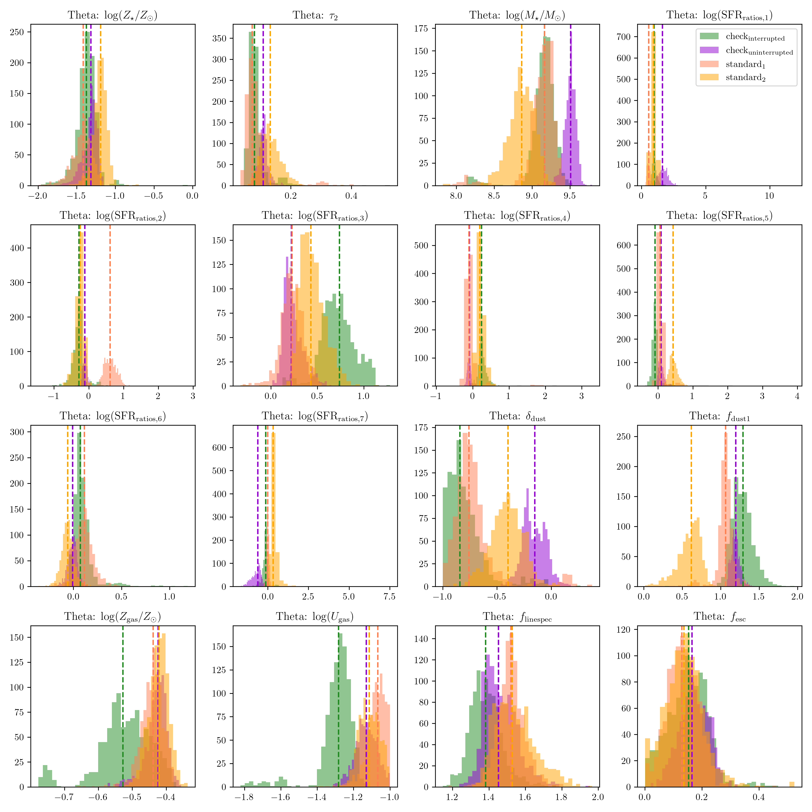

# DynestyCheckpoints

## Overview

This repository provides a guide on how to integrate checkpointing into your Prospector sampling process using Dynesty. The specific version used for development can be found in the `environment.yml` file. While this implementation might not work out-of-the-box for your code, it can serve as a helpful reference for your own checkpointing implementation.

## Integration Steps

To integrate the checkpointing functionality, follow these steps:

1. **Replace Files:**
   - Copy the provided `fitting.py` and `nested.py` files into the `prospect` directory within your Python 3.10 environment. The path should be similar to `python3.10/site-packages/prospect/fitting/xxx.py`.

2. **How to modify `prospect.fitting.fit_model()`:**
   - The `fitting.py` file includes a function called `run_dynesty_sampler` which has been adapted to incorporate a checkpoint file name (`hfile`).
   - When using Prospector, ensure you add a name for the `hfile` to separate different checkpoint files for different runs. Here is an example of how the fitting code might look:

    ```python
    hfile = os.path.join(args.path_output, hfile_name)
    hame = hfile.rstrip(".h5") + '_'
    output = fit_model(obs, model, sps, noise, hfile=hame, **run_params)
    ```

   - If no name is provided, the output will automatically be called `noname_dynesty_checkpoint_file.pkl`.

3. **Modifications in `nested.py`:**
   - The `nested.py` file contains another version of the `run_dynesty_sampler` function that includes checkpointing functionality.
   - You can change the default names for the checkpoint files within this function.
   - Additionally, you can modify the checkpoint intervals. The default interval is set to create a checkpoint every 60 seconds.

## Customization

### Checkpoint File Naming

To customize the naming convention of your checkpoint files, adjust the relevant lines in `nested.py`:

```python
dynesty_checkpoint_file = 'your_chosen_name.pkl'
```
resulting in the output:

```python
filename = 'hfile_name' + 'your_chosen_name.pkl'
```

### Checkpoint File Naming

To change the checkpoint intervals, modify the interval settings in `nested.py`:

```python
checkpoint_interval = 60  # in seconds, adjust as needed
```
colors = ['darkviolet', 'dodgerblue', 'forestgreen', 'orange', 'coral']
## Evaluation

To evaluate how well the interrupted sampling works, we compare two uninterrupted runs, executed with the nested file originally provided by Prospector (run <span style="color:orange">standard_1</span>, <span style="color:coral">standard_2</span>), to two runs conducted with our code, <span style="color:forestgreen">check_interrupted</span> and <span style="color:darkviolet">check_uninterrupted</span>. In the following figure, we compare the outcomes for the different parameters. As can be seen, none of the runs stands out as always being different from the others. The runs executed with the standard code do not show more similarities than the other two runs. The interrupted run was interrupted multiple times in the initial and the batch phase.



A comparison for the posteriors can be found here in figure [cornerplot](img/cornerplot.png). The standard runs are shown in  <span style="color:coral">red</span> and <span style="color:orange">orange</span>, the uninterrupted run that was producing checkpoints along the way is shown in <span style="color:darkviolet">violet</span>, and the interrupted run in  <span style="color:forestgreen">green</span>.


## Summary

By following these steps, you can implement checkpointing in your Prospector sampling process using Dynesty. This implementation provides flexibility in naming and interval settings to suit your specific requirements. While this guide is tailored to a particular setup, it offers a framework that you can adapt for your own projects.

For any further customization or troubleshooting, refer to the provided `environment.yml` file and the Prospector and Dynesty documentation, or email me: [aas208@cam.ac.uk](mailto:aas208@cam.ac.uk).


